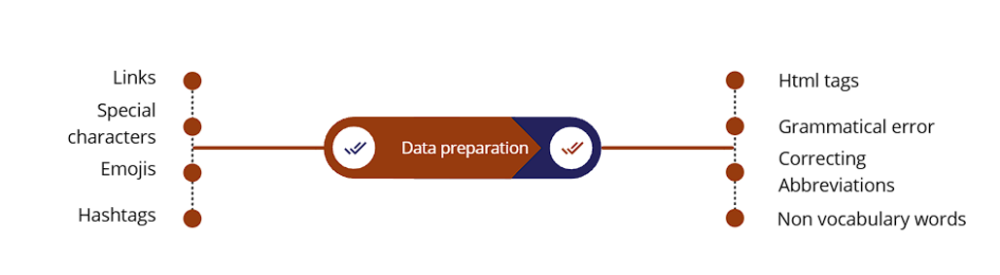
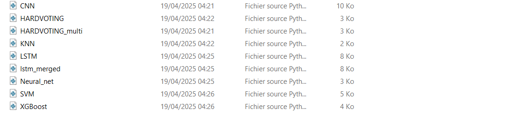
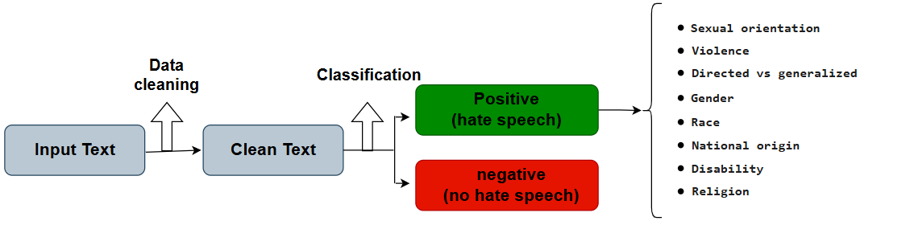

# 🚫 Hate Speech Detection Using NLP Techniques

## 📌 Project Overview
This project detects hate speech in text using **NLP techniques** and **deep learning models**. It processes raw text (including spelling errors), cleans data, augments with paraphrasing, trains classification models (e.g., LSTM), and deploys a **Django interface** for real-time prediction. The LSTM model is selected for its superior performance in classifying hate speech.

---

## 📂 Dataset
- **Custom Dataset**: Collected text data with labels (hate speech or not), stored in a local CSV file.
- Input: Raw text with possible errors; Output: Binary classification (0/1) and the type of hate speech.

---

## 🔍 Project Workflow

### **1. Data Cleaning**
Preprocess raw text by removing links, special characters, emojis, and correcting grammar.

```python
import re
import pandas as pd
import string
import nltk
import language_tool_python

tool = language_tool_python.LanguageTool('en-US')

def preprocess_text(text):
    text = str(text).lower()
    text = re.sub(r'http\S+|www\S+', '', text)  # Remove links
    text = re.sub(r'[^\w\s]', '', text)  # Remove special chars
    text = re.sub(u"[\U0001F600-\U0001F64F\U0001F300-\U0001F5FF\U0001F680-\U0001F6FF\U0001F1E0-\U0001F1FF]+", '', text)  # Remove emojis
    text = tool.correct(text)  # Correct grammar
    return text
```

### **2. Data Augmentation**
Paraphrase sentences using Pegasus to expand the dataset.

```python
from transformers import PegasusTokenizer, PegasusForConditionalGeneration

model_name = 'tuner007/pegasus_paraphrase'
tokenizer = PegasusTokenizer.from_pretrained(model_name)
model = PegasusForConditionalGeneration.from_pretrained(model_name)

def get_response(input_text, num_return_sequences=3, num_beams=10):
    batch = tokenizer([input_text], truncation=True, padding='longest', max_length=60, return_tensors="pt")
    translated = model.generate(**batch, max_length=60, num_beams=num_beams, num_return_sequences=num_return_sequences, temperature=1.5)
    return tokenizer.batch_decode(translated, skip_special_tokens=True)

# Augment DataFrame
new_comments = []
for comment in df['cleaned_comment']:
    if isinstance(comment, str) and comment.strip():
        paraphrases = get_response(comment)
        new_comments.extend(paraphrases)
```

### **3. Model Training**
Train multiple classification models; LSTM is selected as the best.

```python
class LSTMClassifier:
    def __init__(self, tokenizer, embedding_dim=768, lstm_units=300, dropout_rate=0.3):
        # Initialize model parameters and tokenizer
        self.tokenizer = tokenizer
        self.embedding_dim = embedding_dim
        self.lstm_units = lstm_units
        self.dropout_rate = dropout_rate
        self.max_length = tokenizer.model_max_length
        self.model = self._build_model()
        
    def _build_model(self):
        # Build a sequential model with bidirectional LSTM and dense layers
        model = Sequential([
            Bidirectional(LSTM(units=self.lstm_units, input_shape=(None, self.embedding_dim), return_sequences=True)),
            BatchNormalization(),
            Dropout(self.dropout_rate),
            Bidirectional(LSTM(units=self.lstm_units // 2, return_sequences=False)),
            BatchNormalization(),
            Dropout(self.dropout_rate),
            Dense(256, activation='relu'),
            BatchNormalization(),
            Dropout(self.dropout_rate),
            Dense(128, activation='relu'),
            BatchNormalization(),
            Dropout(self.dropout_rate // 2),
            Dense(1, activation='sigmoid')
        ])
        
        # Compile model with Adam optimizer and binary crossentropy loss
        model.compile(
            optimizer=Adam(learning_rate=0.0001, beta_1=0.9, beta_2=0.999),
            loss='binary_crossentropy',
            metrics=['accuracy', 'Precision', 'Recall']
        )
        return model
    
    def train_model(self, trainset, testset, epochs=50, batch_size=32, validation_split=0.2):
        # Convert DataFrame embeddings and labels to TensorFlow tensors
        X_train = tf.constant(trainset["comment_embedding"].tolist(), dtype=tf.float32)
        y_train = tf.constant(trainset["label"].tolist(), dtype=tf.int32)
        X_test = tf.constant(testset["comment_embedding"].tolist(), dtype=tf.float32)
        y_test = tf.constant(testset["label"].tolist(), dtype=tf.int32)
        
        # Adjust input dimensions for LSTM
        if len(X_train.shape) == 4:
            X_train = tf.squeeze(X_train, axis=2)
            X_test = tf.squeeze(X_test, axis=2)
        elif len(X_train.shape) == 2:
            X_train = tf.expand_dims(X_train, axis=1)
            X_test = tf.expand_dims(X_test, axis=1)
            
        # Define callbacks for early stopping and learning rate reduction
        early_stopping = EarlyStopping(monitor='val_loss', patience=5, restore_best_weights=True, mode='min')
        reduce_lr = ReduceLROnPlateau(monitor='val_loss', factor=0.2, patience=3, min_lr=1e-6, mode='min')
        
        # Train the model with validation data and callbacks
        history = self.model.fit(
            X_train, y_train,
            epochs=epochs,
            batch_size=batch_size,
            validation_split=validation_split,
            validation_data=(X_test, y_test),
            callbacks=[early_stopping, reduce_lr],
            verbose=1
        )
```

### **4. Model Testing with Django Interface**
Test the model via a Django web app, processing input text and classifying hate speech.

```python
import os
import sys


def main():
    """Run administrative tasks."""
    os.environ.setdefault('DJANGO_SETTINGS_MODULE', 'app.settings')
    try:
        from django.core.management import execute_from_command_line
    except ImportError as exc:
        raise ImportError(
            "Couldn't import Django. Are you sure it's installed and "
            "available on your PYTHONPATH environment variable? Did you "
            "forget to activate a virtual environment?"
        ) from exc
    execute_from_command_line(sys.argv)


if __name__ == '__main__':
    main()
```

---

## 📊 Results
- **Cleaning Visualization**:

  
  
- **Models Comparison**:

  
  
- **Steps**:

  
  
- **Test Video**:

  https://github.com/user-attachments/assets/0f370dc7-e445-431e-b6bf-ddace48885c9

---

## 📦 Requirements
```bash
pip install pandas numpy transformers tensorflow matplotlib keras seaborn scikit-learn torch sentencepiece nltk spacy language-tool-python plotly nbformat wordcloud palettable textblob cufflinks lime shap tf-keras imblearn faiss-cpu accelerate xgboost openai shap ipython
```

---

## ▶️ How to Run
1. Clone the repository:
   ```bash
   git clone https://github.com/yourusername/hate-speech-detection.git
   cd hate-speech-detection
   ```
2. Create and activate virtual environment:
   ```bash
   python -m venv venv
   .\venv\Scripts\Activate
   ```
3. Install dependencies:
   ```bash
   pip install -r requirements.txt
   ```
4. Run Django server:
   ```bash
   python manage.py runserver
   ```
   Access at `http://127.0.0.1:8000/` and input text for classification.

---

## 📌 Key Insights
- Data cleaning corrects errors and removes noise for reliable classification.
- Pegasus augmentation expands the dataset with paraphrased variations.
- LSTM excels in capturing sequential patterns in text for hate speech detection.
- Django interface enables real-time testing with preprocessing.

## Alternative Approaches
- **Falcon LLM**: A large language model for generating and classifying text, effective for nuanced hate speech detection.
- **DeBERTa**: Decoder-only BERT variant optimized for understanding text nuances in classification tasks.
- **BERT**: Bidirectional Encoder Representations from Transformers, pre-trained for contextual text understanding.
- **RoBERTa**: Robustly optimized BERT approach, improving performance on downstream NLP tasks like classification.

See `other_approaches/` for test details.

---

## 📜 License
MIT License
